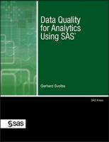

# Data-Quality-for-Data-Science-Using-SAS
Considerations and best practices for data quality in the context of data science, analytics and machine learning and how to implement this with SAS Software. Companion and Download Site for the [SAS Press Book](https://www.sas.com/store/prodBK_63164_en.html?storeCode=SAS_US&storeCode=SAS_US)  "Data Quality for Analytics Using SAS" by Gerhard Svolba. [--> amazon.com](https://www.amazon.com/Data-Quality-Analytics-Using-SAS-ebook-dp-B00AY1AQUY/dp/B00AY1AQUY/)

* [SGF-Paper: Want an Early Picture of the Data Quality Status of Your Analysis Data?
SAS® Visual Analytics Shows You How](https://support.sas.com/resources/papers/proceedings15/SAS1440-2015.pdf)
* [SGF-Presentation 2015](https://github.com/gerhard1050/DataScience-Presentations-By-Gerhard/blob/master/118_DataQualityForAnalyticsUsingSAS_Svolba.pdf)
* SAS Communities Articles
** [The structure of MISSING VALUES in your data - get a clearer picture with the %MV_PROFILING macro](https://communities.sas.com/t5/SAS-Communities-Library/The-structure-of-MISSING-VALUES-in-your-data-get-a-clearer/ta-p/712770)
** [Using the TIMESERIES procedure to check the continuity of your timeseries data](https://communities.sas.com/t5/SAS-Communities-Library/Using-the-TIMESERIES-procedure-to-check-the-continuity-of-your/ta-p/714678)
** [Replace MISSING VALUES in TIMESERIES DATA using PROC EXPAND and PROC TIMESERIES](https://communities.sas.com/t5/SAS-Communities-Library/Replace-MISSING-VALUES-in-TIMESERIES-DATA-using-PROC-EXPAND-and/ta-p/714806)

* [“Rosetta Stone” — The most important text sample in history and the role of labeled data in machine learning](https://gerhard-svolba.medium.com/rosetta-stone-the-most-important-text-sample-in-history-and-the-role-of-labeled-data-in-a890c782344c)
* [Other books](https://support.sas.com/en/books/authors/gerhard-svolba.html) from Gerhard Svolba at SAS Press.
* [Data Preparation for Data Science Using SAS](https://github.com/gerhard1050/Data-Preparation-for-Data-Science-Using-SAS)
* [Applying Data Science - Business Case Studies Using SAS](https://github.com/gerhard1050/Applying-Data-Science-Using-SAS)

## Main focus of this book --> Analytics and Data Science
My intention was not to write another book on data quality in general, but to write the first book that deals with data quality from the viewpoint of a data scientist, statistician, data miner, engineer, operations researcher, or other analytically minded problem-solver.
Data quality is getting a lot of attention in the market. However, most of the initiatives, publications, and papers on data quality focus on classical data quality topics, such as elimination of duplicates, standardization of data, lists of values, value ranges, and plausibility checks. It will not be said here that these topics are not important for analytics; on the contrary, they build the foundation of data for analysis. However, there are many aspects of data that are specific to analytics. And these aspects are important to differentiate whether data are suitable for analysis or not.

The following points are the main focus of this book:
* Usability and availability of data for analysis
*	Selection of the right data sources
*	Explaining why analytical methods need historic data and also historic snapshots of the data
*	Ensuring sufficient data quantity in terms of number of observations, number of event cases, and length of data history
*	Typical analyses: predictive analytics and statistics, including time series analysis and time series forecasting
*	Types of research are mainly observational studies, where existing data of the company or organization itself is used for the analysis (partly also controlled studies where the required data for the analysis is retrieved in a controlled way)
*	Data completeness in terms of profiling of the number and the structure of missing values, finding special types of missing values, replacement of missing values, advanced imputation methods
*	Consideration of the operational, data management, and analysis process point of view
*	Data relevancy with respect to the definition of the data and the requirements of the analysis
*	Data correction with focus on analytic profiling of outliers and complex data validation 
*	Methods in SAS on how to perform advanced profiling of the data quality status and what SAS can offer for the improvement of data quality
*	Simulation studies and consequences of poor data quality for predictive modeling and time series forecasting

## Main parts of this book
This book is divided into three main parts. The naming and ordering of these three parts and the respective chapters follow a process as well, but also consider a segmentation of the content of this book into well-defined parts and a good readable sequence of topics and chapters.
The three parts of this book are:
*	Data Quality Defined
*	Data Quality—Profiling and Improvement
*	Consequences of Poor Data Quality—Simulation Studies

## The data quality criteria that are defined in this book in chapters 3–9 are the following.
*	Chapter 3, “Data Availability,” starts with the question as to whether data are available in general.
*	Chapter 4, “Data Quantity,” examines whether the amount of data are sufficient for the analysis.
*	Chapter 5, “Data Completeness,” deals with the fact that available data fields may contain missing values.
*	Chapter 6, “Data Correctness,” checks whether the available data are correct with respect to its definition.
*	Chapter 7, “Predictive Modeling,” discusses special requirements of predictive modeling methods.
*	Chapter 8, “Analytics for Data Quality,” shows additional requirements of interdependences of analytical methods and the data.
*	Chapter 9, “Process Considerations for Data Quality,” finally shows the process aspect of data quality and also discusses aspects like data relevancy and possible alternatives.

- [Book Excerpt](https://www.sas.com/storefront/aux/en/spdataqualityanalytics/63164_excerpt.pdf)
- [Table of Contents](https://www.sas.com/storefront/aux/en/spdataqualityanalytics/63164_toc.pdf)
